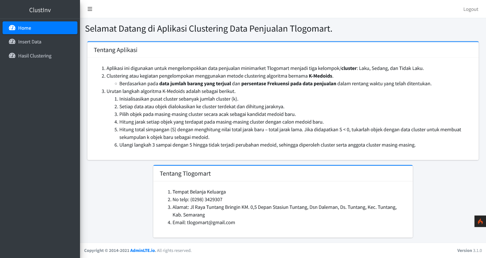
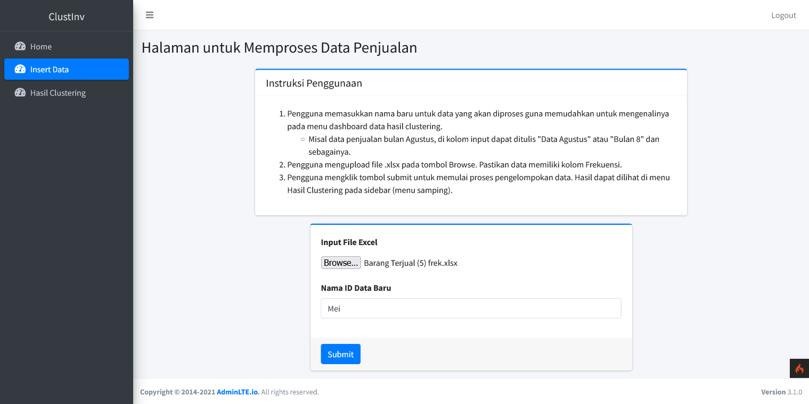
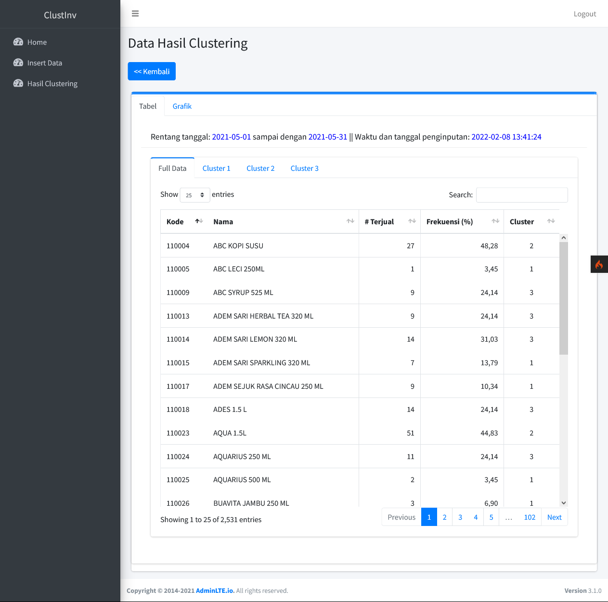
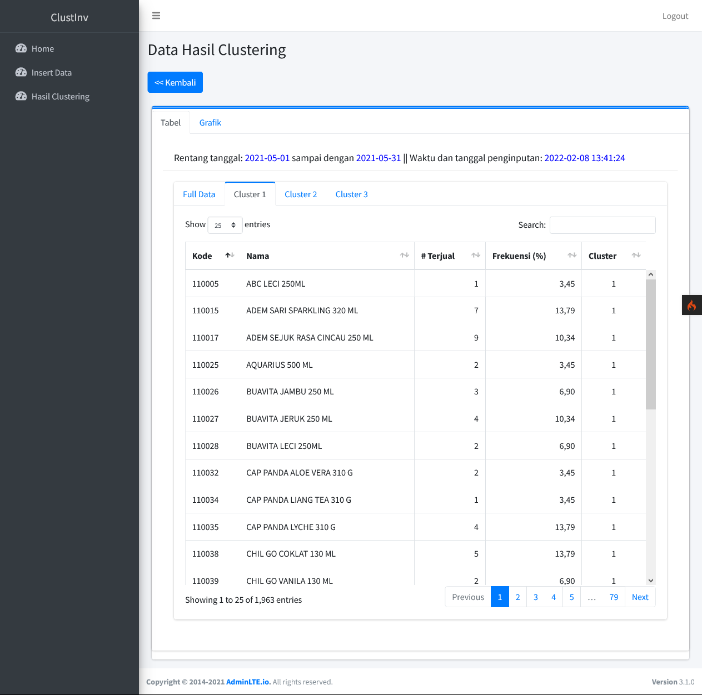
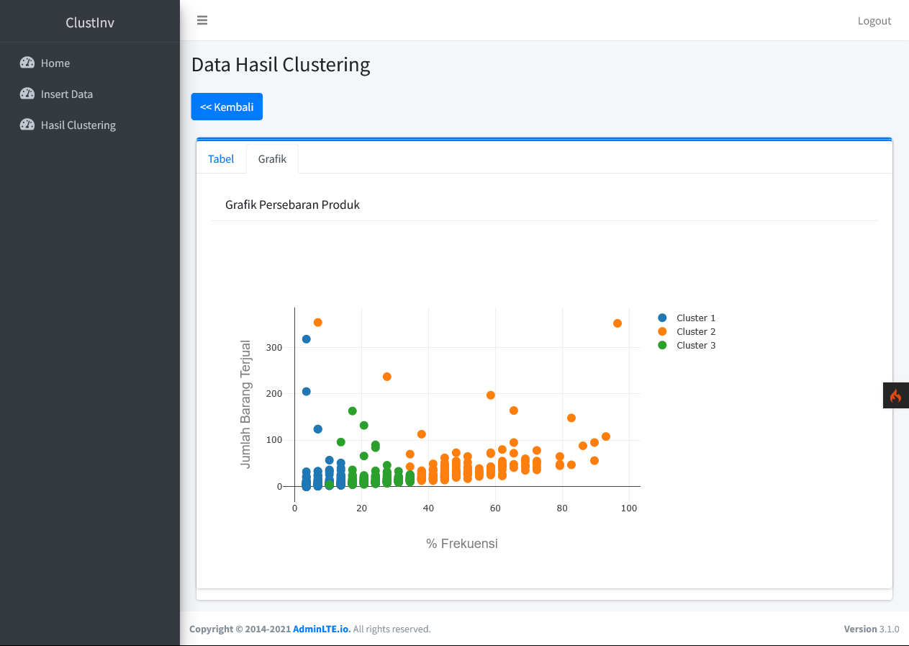

Web based application to clusterize the sales data of a minimarket.
Uses K-Medoids algorithm and DBI to measure the clustering result.
Built using Codeigniter 4.

Screenshots:
1. Dashboard page

2. Input data page

3. Result page

3.1. Result in table form 1 and 2

3.2. Result in graph form

